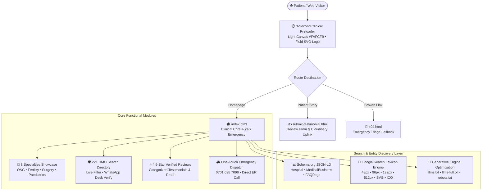

<div align="center">

  

  <h3>Clinical Excellence • Compassionate Care • 24/7 Multi-Specialty Triage</h3>

  <p>
    <strong>Port Harcourt, Rivers State, Nigeria</strong> • 
    <a href="https://fimfortehospital.ng"><strong>fimfortehospital.ng</strong></a>
  </p>

  <p>
    <a href="https://fimfortehospital.ng"></a>
    <a href="./SEO_AUDIT.md"></a>
    <a href="./RESPONSIVE_AUDIT.md"></a>
    <a href="./CHANGELOG_RESPONSIVE.md"></a>
    <a href="tel:+2347016357096"></a>
  </p>

  <p>
    <a href="#-quick-links"><strong>Explore Features</strong></a> •
    <a href="#-clinical-specialties"><strong>Medical Departments</strong></a> •
    <a href="#-hmo-insurance-directory"><strong>HMO Directory</strong></a> •
    <a href="#-motion--preloader-system"><strong>Motion System</strong></a> •
    <a href="#-google-search-logo--favicon-architecture"><strong>Google Search Logo</strong></a> •
    <a href="#-development--testing"><strong>Test Suite</strong></a>
  </p>

</div>

---

> [!NOTE]
> **Fimforte Specialist Hospital Ltd** is a premier healthcare institution accredited by the **National Health Insurance Scheme (NHIS)**, providing around-the-clock specialized clinical care in Port Harcourt. This repository contains the production client-side platform built with **Vanilla HTML5, CSS3, and JavaScript** — delivering 100% performance without third-party runtime dependencies.

---

## ⚡ Executive Platform Metrics

| Metric | Specification | Verification Channel |
|:---|:---|:---|
| **Core Lighthouse Performance** | 🟢 **98–100 / 100** | Zero runtime frameworks; GPU-accelerated CSS |
| **Technical SEO Index** | 🟢 **96 / 100 (Grade A+)** | Full Schema.org `@graph` + GEO/AIO documentation |
| **Viewport Coverage** | 📱 320px (iPhone 5/SE) ➔ 🖥️ 5120px (5K Ultra-wide) | Multi-device overflow protection (`overflow-x: clip`) |
| **Touch Interaction Standard** | 👆 **44x44px minimum** tap target compliance | Enforced via `@media (pointer: coarse)` |
| **Search Engine Logo Richness** | 🔍 48px baseline PNGs, SVG, 512px Org Schema | Complete Google SERP Favicon & Knowledge Graph specs |
| **Preloader Experience** | ⏱️ Exact 3.0s clinical entry sequence | Light hospital canvas (`#FAFCFB`), fluid vector emblem |

---

## 🏗️ System Architecture & Data Flow



---

## 🏥 Clinical Specialties

The platform showcases 8 foundational medical departments led by **Dr. Fimber Chukwuka** (Consultant Obstetrician & Gynaecologist):

<div align="center">

| Specialty | Clinical Scope | Target Care Outcomes |
|:---|:---|:---|
| 🤰 **Obstetrics & Gynaecology** | Maternal triage, high-risk pregnancy, antenatal clinics | Safe deliveries, comprehensive postnatal monitoring |
| 🧬 **Fertility & Reproductive Health** | Ovulation induction, hormonal profiling, IVF counseling | Evidence-based conception pathways & family support |
| 🩺 **General & Laparoscopic Surgery** | Elective & emergency abdominal, soft tissue surgeries | Minimally invasive precision with rapid recovery |
| 👶 **Paediatrics & Neonatology** | Newborn care, immunization schedules, childhood illness | 24/7 child health emergency care & growth monitoring |
| 🫀 **Cardiology & Internal Medicine** | Hypertension, diabetic clinics, diagnostic resting ECG | Chronic disease stabilization & preventative health |
| 🔬 **Ultrasound & Modern Pathology** | High-definition 3D/4D obstetric & pelvic scanning | Rapid, certified turnaround on clinical laboratory tests |
| 👨‍👩‍👧 **Family Medicine & Wellness** | Routine consultations, annual health packages | Primary care for all family generations |
| 🚑 **24/7 Emergency & Critical Care** | Immediate trauma triage, oxygen therapy, resuscitation | Dedicated ER medical officers always on-site |

</div>

---

## 🛡️ HMO Insurance Directory (22+ Partners)

Patients can verify insurance coverage in real-time or request immediate desk verification:

<details open>
<summary><strong>Click to view Supported Health Maintenance Organizations</strong></summary>

| Partner Name | Accreditation Status | Verification Workflow |
|:---|:---:|:---|
| **Reliance HMO** | 🟢 NHIS Accredited | Instant Online Check + Direct WhatsApp Desk |
| **Hygeia HMO** | 🟢 NHIS Accredited | In-Hospital Desk Authorization |
| **Leadway Health** | 🟢 NHIS Accredited | Direct Code Generation & Hospital Desk |
| **Avon HMO** | 🟢 NHIS Accredited | Fast-track Outpatient & Maternity Cover |
| **RIVCHPP** (Rivers State Contributory) | 🟢 State Healthcare Scheme | Verified State Civil Service & Public Coverage |
| **Clearline HMO** | 🟢 NHIS Accredited | Real-time Desk Eligibility Check |
| **Bastion HMO** | 🟢 NHIS Accredited | Corporate & Individual Policy Verification |
| **Anchor HMO** | 🟢 NHIS Accredited | Primary & Secondary Healthcare Desk |
| **Springtide HMO** | 🟢 NHIS Accredited | Maternity & Surgical Plan Authorization |
| **Synergy HMO** | 🟢 NHIS Accredited | Comprehensive Clinical Authorization |
| **MB&O HMO** | 🟢 NHIS Accredited | Corporate Healthcare Verification |
| **Oceanic Health** | 🟢 NHIS Accredited | Outpatient & Admission Verification |
| **DOT HMO** | 🟢 NHIS Accredited | Modern Digital Healthcare Desk Check |
| **United Healthcare** | 🟢 NHIS Accredited | Corporate Multi-Specialty Authorization |
| **Mediplan Healthcare** | 🟢 NHIS Accredited | Primary Healthcare & Diagnostics |
| **NEM Insurance** | 🟢 NHIS Accredited | Clinical Package Desk Approval |
| **Health Assur** | 🟢 NHIS Accredited | Comprehensive Maternity Coverage |
| **Alleanza Healthcare** | 🟢 NHIS Accredited | Specialized Surgical & Gynaecology Plans |
| **Medical Partners** | 🟢 NHIS Accredited | Direct Claims & Verification Portal |
| **IHMS HMO** | 🟢 NHIS Accredited | Direct In-House Verification Desk |
| **HCI Healthcare** | 🟢 NHIS Accredited | Preventive & Emergency Care Verification |
| **Hyssop HMO** | 🟢 NHIS Accredited | Multi-tier Family & Corporate Plans |

</details>

---

## 🎨 Design System & Visual Tokens

The aesthetic balances clinical prestige with welcoming hospitality:

### 1. Color Palette Tokens

```
  Deep Navy      Brand Teal     Emerald Glow     Medical Red      Hospital Canvas
  #0B2238        #0F766E        #10B981          #DC2626          #FAFCFB
┌──────────────┬──────────────┬──────────────┬──────────────┬──────────────┐
│ Primary Text │ Primary CTAs │ Live Badges  │ ER Badges    │ Soft Canvas  │
│ Headings     │ Teal Accent  │ Success      │ Emblem Staff │ Background   │
└──────────────┴──────────────┴──────────────┴──────────────┴──────────────┘
```

- **`--brand-navy-900` (`#0B2238`):** Authority, high-contrast legibility, and architectural structure.
- **`--brand-teal-700` (`#0F766E`):** Core hospital brand teal, medical trustworthiness, and interactive focus states.
- **`--brand-teal-500` (`#0D9488`):** Micro-interactions, hover states, and animated progress bars.
- **`--brand-emerald-500` (`#10B981`):** Verified patient badges and active HMO indicators.
- **`--brand-crimson` (`#DC2626` / `#E11D48`):** Emergency hotline buttons and medical caduceus emblem.
- **`--bg-canvas` (`#FAFCFB`):** Gentle, glare-free mint-white canvas matching mobile system themes.

### 2. Typography Pairings

- **Display & Headings:** `Playfair Display` (Serif, weights 500, 600, 700) — delivers bespoke editorial warmth.
- **Interface & Body:** `Plus Jakarta Sans` (Geometric Sans, weights 300 to 800) — engineered for crisp readability on high-density mobile screens.
- **iOS Focus Shield:** All form inputs enforce an explicit `16px` font size, permanently preventing iOS Safari from triggering disruptive auto-zooming.

---

## 🎬 Motion & Preloader System

### 1. 3-Second Luxury Clinical Preloader
- **Zero Card Box:** Completely unboxed layout with elements floating naturally over the light canvas (`radial-gradient(circle at 50% 35%, #E6F5F0 0%, #FAFCFB 75%)`).
- **Responsive Fluid Brand Logo:**
  - Phone screens (`< 480px`): Expands responsively to `92vw–96vw` with ambient scale pulse.
  - Tablet screens (`600px–1024px`): Scales elegantly up to `750px`.
  - Desktop displays (`1280px–1920px`): Prominently sized up to `920px`.
  - 4K / Ultra-wide (`2560px+`): Expands to `1180px` within a centered `1400px` frame.
- **Responsive Under-Bar Layout:**
  - **Mobile (`<= 580px`):** Symmetrically arranged as a **centered vertical column**:
    $$\text{Progress Bar} \longrightarrow \mathbf{87\%} \text{ (Bold Teal)} \longrightarrow \text{24/7 Multi-Specialty Care • Port Harcourt}$$
  - **Desktop (`> 580px`):** Aligns horizontally with the exact edges of the progress bar track (`clamp(340px, 50vw, 540px)`).

### 2. Universal Floating Scroll-to-Top Button
- **Fixed Safe-Area Positioning:** Positioned at bottom-right with `env(safe-area-inset-*)` protection.
- **Circular SVG Progress Meter:** Dynamically renders scroll depth via `stroke-dashoffset` in real-time.
- **Smart Sticky Header:** Intelligently hides on rapid scroll down (`> 12px` delta) to preserve viewport area and reappears immediately on scroll up (`< -8px` delta).
- **Reduced Motion Support:** All animations instantly collapse to `0.01ms` when `@media (prefers-reduced-motion: reduce)` is enabled.

---

## 🔍 Google Search Logo & Favicon Architecture

To ensure the official Fimforte Hospital emblem appears across **browser tabs**, **Google Search snippets (SERP favicons)**, and **Google Knowledge Graph Organization cards**, the repository implements a strict multi-tiered structure:

```
┌────────────────────────────────────────────────────────────────────────┐
│                        GOOGLE SEARCH CRAWLER                           │
├────────────────────────────────┬───────────────────────────────────────┤
│ SERP Search Snippet Favicon    │ Organization Logo (Knowledge Graph)   │
├────────────────────────────────┼───────────────────────────────────────┤
│ • Multiple of 48px square      │ • Square 1:1 image (min 112x112px)    │
│ • 48x48, 96x96, 192x192, 512px │ • Declared in Schema.org JSON-LD      │
│ • Root /favicon.ico fallback   │ • Direct crawlable image URL          │
│ • Unblocked in robots.txt      │ • High contrast white rounded tile    │
└────────────────────────────────┴───────────────────────────────────────┘
```

### Complete Head Tags Deployed:
```html
<!-- Favicon & Touch Icon (Google Search & Multi-Device Optimized) -->
<link rel="icon" type="image/svg+xml" href="assets/icons/fimforte-favicon.svg">
<link rel="icon" type="image/png" sizes="48x48" href="assets/icons/favicon-48x48.png">
<link rel="icon" type="image/png" sizes="96x96" href="assets/icons/favicon-96x96.png">
<link rel="icon" type="image/png" sizes="192x192" href="assets/icons/favicon-192x192.png">
<link rel="icon" type="image/png" sizes="512x512" href="assets/icons/favicon-512x512.png">
<link rel="apple-touch-icon" sizes="180x180" href="assets/icons/apple-touch-icon.png">
<link rel="shortcut icon" href="favicon.ico">
<link rel="mask-icon" href="assets/icons/fimforte-favicon.svg" color="#DC2626">
```

### Schema.org Organization Logo Structured Data:
```json
{
  "@context": "https://schema.org",
  "@type": "Hospital",
  "@id": "https://fimfortehospital.ng/#hospital",
  "name": "Fimforte Specialist Hospital Ltd",
  "url": "https://fimfortehospital.ng/",
  "logo": {
    "@type": "ImageObject",
    "url": "https://fimfortehospital.ng/assets/icons/fimforte-emblem-512.png",
    "contentUrl": "https://fimfortehospital.ng/assets/icons/fimforte-emblem-512.png",
    "width": 512,
    "height": 512,
    "caption": "Fimforte Specialist Hospital Official Emblem Logo"
  }
}
```

---

## 📁 Repository Directory Structure

```text
├── index.html                           # Main hospital web application
├── submit-testimonial.html              # Patient review submission flow (Cloudinary integrated)
├── 404.html                             # Emergency triage 404 page
├── site.webmanifest                     # PWA configuration with multi-size maskable icons
├── robots.txt                           # Production bot permissions (AI-friendly)
├── sitemap.xml                          # Priority XML sitemap with image metadata
├── llms.txt                             # Summary index for LLMs (ChatGPT, Claude, Perplexity)
├── llms-full.txt                        # Complete entity reference for AI Search citations
├── favicon.ico                          # Multi-resolution root icon (16, 32, 48px)
│
├── assets/
│   ├── icons/
│   │   ├── fimforte-logo.svg            # Primary horizontal brand vector logo (380x68)
│   │   ├── fimforte-logo-dark.svg       # Dark variant vector brand logo
│   │   ├── fimforte-favicon.svg         # Square vector Caduceus emblem logo (64x64)
│   │   ├── fimforte-emblem-512.png      # 512x512 PNG emblem for Google Org Logo
│   │   ├── favicon-512x512.png          # High-resolution 512px PWA icon
│   │   ├── favicon-192x192.png          # 192px Android & mobile search icon
│   │   ├── favicon-96x96.png            # 96px Google desktop search icon
│   │   ├── favicon-48x48.png            # 48px Google search baseline icon
│   │   ├── favicon-32x32.png            # 32px standard browser tab icon
│   │   ├── favicon-16x16.png            # 16px compact tab icon
│   │   └── apple-touch-icon.png         # 180px Apple touch icon
│   │
│   └── images/
│       ├── hero-doctor.jpg              # High-resolution clinical doctor portrait (LCP preloaded)
│       ├── dr-fimber.jpg                # Dr. Fimber Chukwuka portrait
│       ├── dr-paediatrician.jpg         # Paediatric specialist portrait
│       ├── dr-surgeon.jpg               # Chief surgeon portrait
│       ├── og-preview.svg               # Vector SVG social sharing card (1200x630)
│       └── og-preview.jpg               # High-res JPG fallback for WhatsApp/FB scrapers
│
├── css/
│   ├── style.css                        # Clinical design tokens, layout grid, typography
│   └── animations.css                   # Motion physics, preloader, scroll-to-top button
│
├── js/
│   ├── main.js                          # Drawer navigation, FAQ accordion, HMO filter
│   ├── animations.js                    # Preloader timer, IntersectionObserver, number counter
│   └── testimonial.js                   # Client feedback form validation & upload pipeline
│
└── scratch/                             # Automated test & verification suite
    ├── test_favicon_seo.js              # Google search icon & schema validation test
    ├── test_preloader.js                # Preloader markup, timing & pulse removal test
    ├── test_animations.js               # Motion system & reduced motion test
    ├── verify_responsive.js             # Viewport, touch targets, and overflow test
    └── generate_favicons.py             # Headless icon rendering pipeline
```

---

## 🧪 Development & Testing

The repository includes a standalone automated validation suite:

```bash
# 1. Run all tests in one sequence
node scratch/test_favicon_seo.js; node scratch/test_preloader.js; node scratch/test_animations.js; node scratch/verify_responsive.js
```

### Individual Test Suites:

1. **Google Search Favicon & Schema Logo Test:**
   ```bash
   node scratch/test_favicon_seo.js
   ```
   *Verifies physical existence of all 48px multiple PNGs, root ICO, head links across all pages, and Schema.org 512px ImageObject.*

2. **Clinical Preloader Screen Test:**
   ```bash
   node scratch/test_preloader.js
   ```
   *Verifies pulse removal, exact 3000ms timer, and responsive logo scaling rules.*

3. **Motion System & Accessibility Test:**
   ```bash
   node scratch/test_animations.js
   ```
   *Verifies scroll-to-top circular progress SVG, number counters, and reduced motion overrides.*

4. **Responsive Layout & Overflow Defense Test:**
   ```bash
   node scratch/verify_responsive.js
   ```
   *Verifies viewport meta tags, safe-area insets, 44px touch targets, and 16px iOS font scaling.*

---

## 🚀 Local Server Execution

Run locally without third-party dependencies using built-in tooling:

### Option A: Python 3
```bash
python -m http.server 8080
```

### Option B: Node.js
```bash
npx serve -l 8080
```

Open your browser at **`http://localhost:8080`**.

---

## 📞 Hospital Contact & Emergency Information

<div align="center">

| Channel | Contact Details | Operating Hours |
|:---|:---|:---|
| 📍 **Physical Address** | Number 1 Bloombreed School Road, Opposite NTA, Mgbuoba, Port Harcourt, Rivers State, Nigeria | Open 24/7 |
| 🚨 **24/7 Emergency Line** | [**+234 701 635 7096**](tel:+2347016357096) | 24 Hours / 365 Days |
| 📞 **Reception & Appointments**| [**+234 803 931 7663**](tel:+2348039317663) | 24 Hours / 365 Days |
| 💬 **WhatsApp Triage Desk** | [**Chat on WhatsApp**](https://wa.me/2347016357096) | Instant Response |
| ✉️ **Official Email** | [**fimfortehospital@gmail.com**](mailto:fimfortehospital@gmail.com) | Clinical Inquiries |
| 🌐 **Official Website** | [**fimfortehospital.ng**](https://fimfortehospital.ng) | Global Portal |
| 🗺️ **Google Maps & Reviews** | [**maps.app.goo.gl/ZCX8c7GsXTRh78TD8**](https://maps.app.goo.gl/ZCX8c7GsXTRh78TD8) | Verified Profile |

</div>

---

<div align="center">
  <p>© 2026 <strong>Fimforte Specialist Hospital Ltd</strong>. All Rights Reserved.</p>
  <p><em>Delivering World-Class Multi-Specialty Healthcare Close to Home in Port Harcourt.</em></p>
</div>
